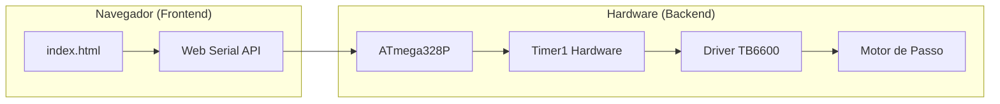

# ⚙️ Controle de Motor de Passo TB6600 (AVR + Web Serial API)

Este projeto oferece um sistema de controle de alta precisão para motores de passo utilizando o driver **TB6600** e um microcontrolador **ATmega328P** (Arduino Uno/Nano). 

O sistema é gerenciado por uma interface web moderna que se comunica diretamente com a placa via USB usando a **Web Serial API**, eliminando a necessidade de instalar softwares adicionais no computador.

---

## ✨ Características Principais

*   **Alta Precisão (Jitter-Free):** Utiliza o Timer1 (16-bits) em modo CTC e *Port Manipulation* nativa do AVR para alternar os pinos em exatos 62,5 nanossegundos, ignorando a latência do `digitalWrite()`.
*   **Zero Bloqueio (Non-blocking):** A rotina principal (`loop()`) roda livremente utilizando uma máquina de estados. Não há uso de `delay()`, permitindo fila de comandos e processamento contínuo em background.
*   **Segurança de Hardware (Atomic & Safe):** Operações críticas como o `STOP` são executadas em blocos atômicos. Inclui um *Safety Clamp* de 50µs para evitar o travamento do microcontrolador por hardware.
*   **Extrema Otimização de Memória:** O protocolo de comunicação foi inteiramente escrito em código Hexadecimal de 8-bits. Zero strings são armazenadas na memória SRAM do microcontrolador.
*   **Interface Web Profissional:** Dashboard reconstruída com Tailwind CSS, apresentando um design "Técnico Minimalista" com alta densidade de informação e zero poluição visual.
*   **Telemetria em Tempo Real:** Painel "Live Telemetry" que monitora o uso da memória SRAM do Arduino e o estado exato da execução mecânica (Linhas/Delays) sem atrasos.
*   **Notificações Inteligentes:** Sistema de *Toasts* que substitui o terminal clássico, classificando alertas por nível de criticidade (Sucesso, Info, Warning, Erro).
*   **Controle Mobile-Friendly:** Layout responsivo otimizado para tablets e smartphones via Web Serial.

---

## 🔌 Esquema de Ligação (Hardware)

Conecte o seu Driver TB6600 ao Arduino conforme a tabela abaixo:

| Pino Arduino | Registrador AVR | Pino Driver TB6600 | Função |
| :--- | :--- | :--- | :--- |
| **D2** | PD2 | **DIR+** | Controle de Direção |
| **D3** | PD3 | **PUL+** | Trem de Pulsos (Step) |
| **D8** | PB0 | **ENA+** | Enable (Ativa/Desativa o Driver) |
| **GND** | - | **DIR-, PUL-, ENA-** | Terra Comum |

> [!NOTE]
> O driver foi configurado no código com lógica de **Enable invertida**, ou seja, mantido em `LOW` para funcionamento padrão.

---

## 🚀 Como Usar

### 1. Preparando o Microcontrolador
1.  Abra o arquivo `stepcontrol/stepcontrol.ino` na Arduino IDE.
2.  Selecione sua placa (Arduino Uno/Nano) e faça o upload.
3.  Certifique-se de que o Baud Rate do código está em **115200 bps**.

### 2. Rodando a Interface Web
Como o projeto utiliza a Web Serial API, por motivos de segurança arquitetural dos navegadores, você não pode simplesmente abrir o arquivo com um clique duplo (`file:///`).

1.  **Use um servidor local:** Se estiver no VS Code, instale a extensão **Live Server** e clique em "Go Live" no arquivo `index.html`.
2.  **Acesse via:** `http://localhost:5500` (ou a porta gerada).
3.  **Navegador compatível:** Utilize **Google Chrome** ou **Microsoft Edge** (Safari e Firefox não suportam Web Serial API nativamente).
4.  Clique em **Conectar Serial**, selecione a porta COM/USB do seu Arduino e comece a adicionar comandos na fila!

---

## 🏗️ Arquitetura do Sistema

O projeto é dividido em dois grandes blocos que se comunicam de forma assíncrona:

---

## 🗄️ Integração e Protocolo (Hexadecimal)

Para garantir máxima performance e economia de memória no AVR, a comunicação utiliza chaves hexadecimais de 1 byte. 

> [!TIP]
> Para detalhes técnicos completos sobre handshakes, fluxos de dados e especificações de cada comando, consulte o **[Guia de Integração Detalhado](./docs/INTEGRATION.md)**.
> Você também pode acompanhar o histórico de melhorias no **[Changelog](./CHANGELOG.md)**.

### Resumo de Comandos Rápidos:

| Código | Função |
| :--- | :--- |
| `01` | **RUN**: Inicia a fila. |
| `02` | **STOP**: Parada de emergência e limpa fila. |
| `10:X` | **STEPS**: Define passos (obrigatório). |
| `11:X` | **VEL**: Define velocidade (mínimo 50µs). |

---

## 🛠️ Detalhes Técnicos Avançados (AVR)

A geração de passos é efetuada no bloco `ISR(TIMER1_COMPA_vect)`. 

A fim de manter a dinâmica de intervalos grandes (motor lento) ou pequenos (motor rápido), a função `moverMotor` adapta automaticamente o prescaler (bits `CS10`, `CS11` do registrador `TCCR1B`).

*   **Intervalos menores que ~32ms:** Prescaler 8 (Resolução de 0.5µs).
*   **Intervalos maiores:** Prescaler 64 (Resolução de 4.0µs, limite máximo de ~262ms entre passos).

Além disso, para respeitar as necessidades dos optoacopladores do driver TB6600, foi garantido um pulso em nível alto de exatos 3 microssegundos por etapa dentro do hardware (`_delay_us(3);`).

---

## Licença

Este projeto é de código aberto e livre para modificações.