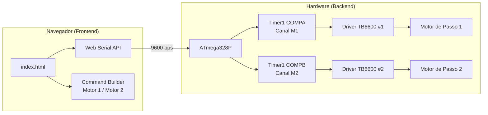

# ⚙️ Controle Dual de Motores de Passo TB6600 (AVR + Web Serial API)

Este projeto oferece um sistema de controle de **alta precisão e dois canais independentes** para motores de passo, utilizando dois drivers **TB6600** e um microcontrolador **ATmega328P** (Arduino Uno/Nano).

O sistema é gerenciado por uma interface web moderna que se comunica diretamente com a placa via USB usando a **Web Serial API**, eliminando a necessidade de instalar softwares adicionais.

---

## ✨ Características Principais

- **Dual Motor Independente:** Dois motores controlados simultaneamente via Timer1 Dual-Channel (COMPA + COMPB). Cada motor possui velocidade, direção e fila de movimento completamente independentes.
- **Alta Precisão (Jitter-Free):** Timer1 de 16 bits em modo *Freerunning* com *Port Manipulation* nativa do AVR. Alternância de pinos em exatos 62,5 ns, sem latência do `digitalWrite()`.
- **Zero Bloqueio (Non-blocking):** A `loop()` roda livremente via máquina de estados. Sem `delay()`, com processamento paralelo de ambos os motores.
- **Segurança de Hardware (Atomic & Safe):** `STOP` executado em bloco atômico (`cli`/`sei`). *Safety Clamp* de 50µs previne travamento do MCU.
- **Otimização de Memória Extrema:** Protocolo H8P inteiramente em hexadecimal de 8 bits — zero strings armazenadas na SRAM.
- **Controle de Driver (Enable/Disable):** Comandos `16` e `17` permitem ativar ou desativar o driver TB6600 de cada motor individualmente em tempo real, com feedback visual na telemetria.
- **Interface Web Profissional:** Dashboard com Tailwind CSS, Telemetria ao Vivo por motor (M1 e M2), sistema de Toasts por criticidade e Command Builder visual.
- **Internacionalização (i18n):** Interface disponível em Inglês (EN-US) e Português (PT-BR) com troca instantânea via toggle no header. Idioma salvo em `localStorage`.
- **Telemetria em Tempo Real:** Painel dual que monitora SRAM, linha ativa, estado do driver e estado de execução de cada motor individualmente.

---

## 🔌 Esquema de Ligação (Hardware)

Conecte os dois Drivers TB6600 ao Arduino conforme as tabelas abaixo:

### Motor 1

| Pino Arduino | Registrador AVR | Pino Driver TB6600 | Função |
| :--- | :--- | :--- | :--- |
| **D2** | PD2 | **DIR+** | Controle de Direção |
| **D3** | PD3 | **PUL+** | Trem de Pulsos (Step) |
| **D8** | PB0 | **ENA+** | Enable (Ativa/Desativa o Driver) |
| **GND** | — | **DIR-, PUL-, ENA-** | Terra Comum |

### Motor 2

| Pino Arduino | Registrador AVR | Pino Driver TB6600 | Função |
| :--- | :--- | :--- | :--- |
| **D4** | PD4 | **DIR+** | Controle de Direção |
| **D5** | PD5 | **PUL+** | Trem de Pulsos (Step) |
| **D7** | PD7 | **ENA+** | Enable (Ativa/Desativa o Driver) |
| **GND** | — | **DIR-, PUL-, ENA-** | Terra Comum |

> [!NOTE]
> Os drivers são controlados com lógica de **Enable invertida**: o pino ENA é mantido em `LOW` durante o funcionamento normal para ativar o driver.

---

## 🚀 Como Usar

### 1. Preparando o Microcontrolador

1. Abra `stepcontrol/stepcontrol.ino` na Arduino IDE.
2. Selecione sua placa (Arduino Uno/Nano) e a porta serial.
3. Clique em **Upload**.
4. O firmware comunica a **9600 bps** — certifique-se de que o Monitor Serial ou a interface web estão na mesma velocidade.

### 2. Rodando a Interface Web

A Web Serial API exige um contexto seguro (`https://` ou `localhost`). Não é possível abrir o `index.html` diretamente como `file:///`.

1. No VS Code, instale a extensão **Live Server** e clique em **Go Live** no arquivo `webinterface/index.html`.
2. Acesse via `http://localhost:5500` (ou a porta gerada).
3. Use **Google Chrome** ou **Microsoft Edge** — Safari e Firefox não suportam Web Serial API nativamente.
4. Clique em **Conectar Serial**, selecione a porta do Arduino, escolha o motor alvo e adicione comandos à fila!

---

## 🏗️ Arquitetura do Sistema



---

## 🗄️ Protocolo de Comunicação (H8P)

Para máxima performance e economia de SRAM no AVR, a comunicação usa chaves hexadecimais de 1 byte.

> [!TIP]
> Para a especificação completa do protocolo — handshakes, fluxos de dados e todos os códigos de resposta — consulte o **[Guia de Integração](./docs/INTEGRATION.md)**.
> Acompanhe o histórico de versões no **[Changelog](./CHANGELOG.md)**.

### Resumo de Comandos

| Código | Função |
| :--- | :--- |
| `01` | **RUN** — Inicia a fila de movimentos. |
| `02` | **STOP** — Parada de emergência e limpeza completa da fila. |
| `03:1` | **REPEAT ON** — Ativa loop infinito da fila para ambos os motores. |
| `03:0` | **REPEAT OFF** — Desativa o loop; fila encerra ao final *(enviado automaticamente junto com RUN)*. |
| `10:X` | **STEPS** — Quantidade de passos *(obrigatório)*. |
| `11:X` | **VEL** — Intervalo entre pulsos em µs, mínimo 50 *(obrigatório)*. |
| `12:X` | **DIR** — Direção: `0` ou `1` *(opcional, default 0)*. |
| `13:X` | **REPEAT** — Ciclos de repetição; `0` = infinito *(opcional, default 1)*. |
| `14:X` | **PAUSE** — Pausa pós-execução em ms *(opcional)*. |
| `15:X` | **MOTOR** — Seleciona o motor alvo: `1` ou `2` *(opcional, default 1)*. |
| `16:X` | **ENABLE MOTOR** — Ativa o driver TB6600 do motor X (EN → LOW). |
| `17:X` | **DISABLE MOTOR** — Desativa o driver TB6600 do motor X (EN → HIGH, eixo livre). |

**Exemplo — Motor 2, 1600 passos, intervalo 500µs, direção 1:**

```
10:1600,11:500,12:1,15:2
```

---

## 🛠️ Detalhes Técnicos AVR

### Timer1 Dual-Channel (Freerunning)

O Timer1 opera em modo **Normal Freerunning** com dois registradores de comparação independentes:

- **OCR1A** → Motor 1 (`ISR(TIMER1_COMPA_vect)`)
- **OCR1B** → Motor 2 (`ISR(TIMER1_COMPB_vect)`)

Cada canal calcula seu próprio `next_compare` relativo ao TCNT1 atual, garantindo que a velocidade de um motor nunca interfira no timing do outro — por mais discrepante que seja a diferença de velocidade entre eles.

### Prescaler Adaptativo

A função `moverMotor()` ajusta o prescaler automaticamente conforme o intervalo pedido:

| Intervalo | Prescaler | Resolução | Limite Máx. |
| :--- | :--- | :--- | :--- |
| < ~32ms | 8 | 0,5 µs | ~32 ms |
| ≥ ~32ms | 64 | 4,0 µs | ~262 ms |

### Pulso de Hardware

Para respeitar o tempo mínimo de ativação dos optoacopladores do TB6600, cada passo garante um pulso HIGH de exatos **3 µs** via `_delay_us(3)`.

### Gate Flag `fila_iniciada`

A limpeza global da fila só é disparada após um RUN confirmado (`01`). Isso impede que a máquina de estados destrua a fila enquanto o usuário ainda está no processo de construção de comandos, antes de enviar o RUN.

### Comportamento da Biblioteca de Sequências

Ao carregar uma sequência salva, a interface envia automaticamente `02` (STOP) para limpar a SRAM do MCU e reseta a fila local antes de injetar os novos comandos. Isso previne acúmulo de comandos duplicados ou residuais.

### RepeatAll Boolean (`03:0` / `03:1`)

O botão **Mestre de Loop** na interface é um toggle visual. O estado só é transmitido ao MCU no momento do **EXECUTE ALL**:
- Toggle **ON** → envia `03:1` (ativa loop) antes de `01`
- Toggle **OFF** → envia `03:0` (desativa loop) antes de `01`

Isso garante que o MCU sempre saiba o estado correto do loop antes de iniciar a execução.

### Controle do Driver (Enable/Disable)

Cada motor possui um toggle switch na interface, integrado ao seletor de motor "Target Motor":

- **Checkbox marcado** (verde) → envia `16:X` (Enable Motor: EN → LOW, torque de retenção ativo).
- **Checkbox desmarcado** (cinza) → envia `17:X` (Disable Motor: EN → HIGH, eixo livre).

O firmware responde com `B7:X` (habilitado) ou `B8:X` (desabilitado), e a telemetria exibe o estado "Driver ON" ou "Driver OFF" em tempo real.

> [!NOTE]
> O TB6600 usa **enable ativo-baixo** — `LOW` habilita o driver e `HIGH` desabilita.

---

## Licença

Este projeto é de código aberto e livre para modificações.