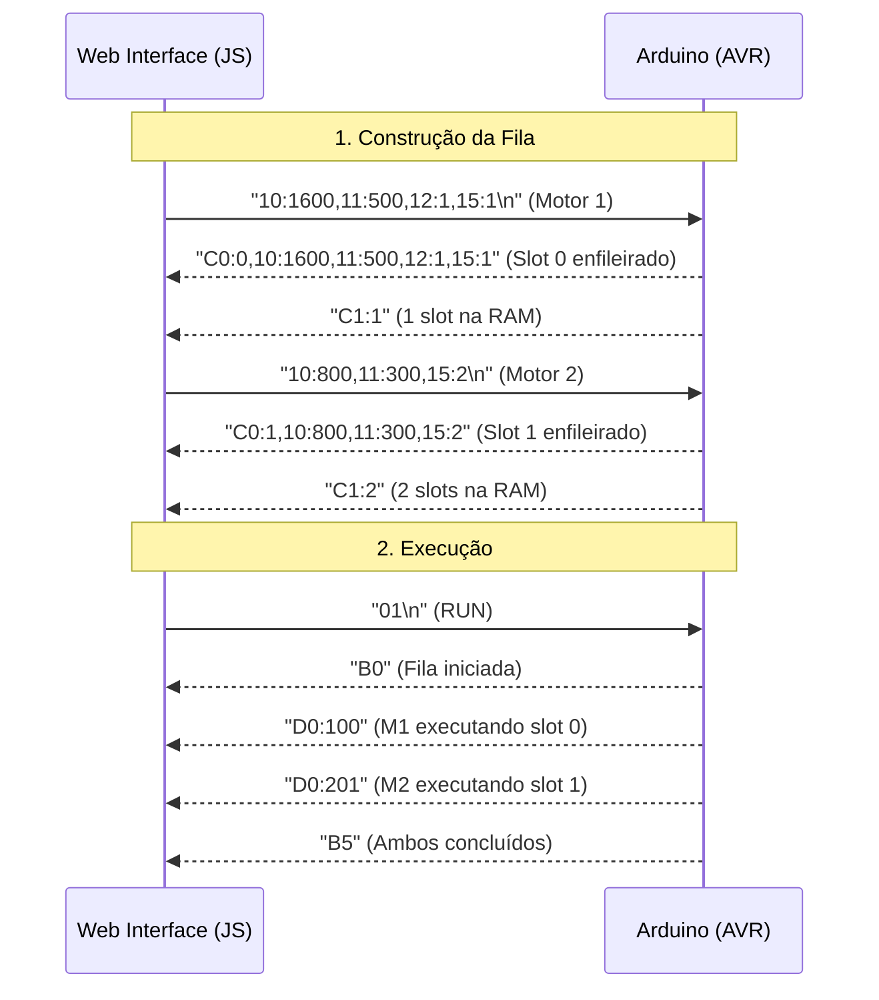
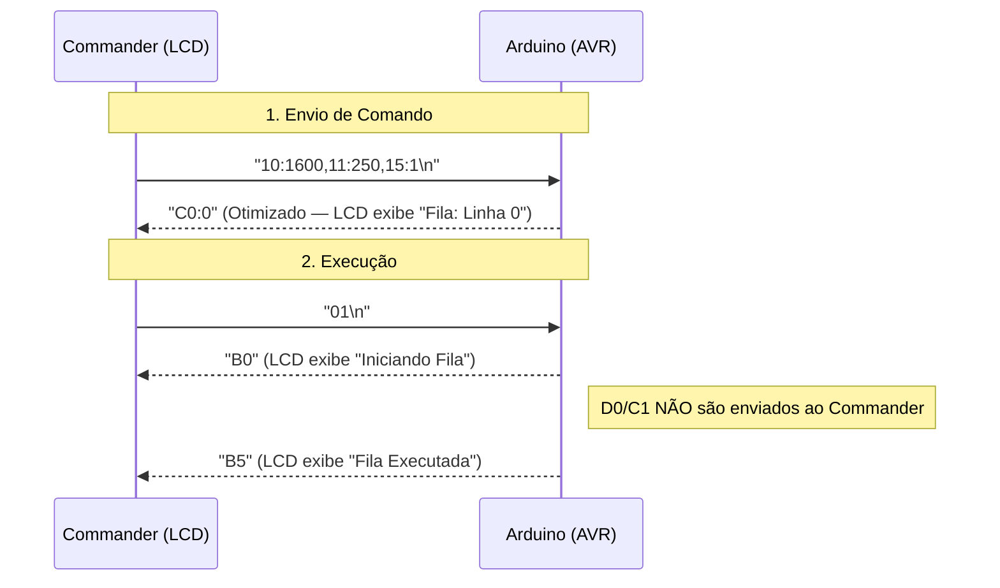

# Guia de Integração: Web Interface <> Firmware AVR

Este documento detalha o protocolo de comunicação e a arquitetura de integração entre a interface HTML5 (frontend), o firmware ATmega328P (backend/hardware) e o módulo periférico StepCommander.

---

## 🏗️ Arquitetura de Comunicação

O projeto possui **duas interfaces de entrada simultâneas** para o firmware principal:

| Canal | Meio Físico | Pinos | Uso |
|:---|:---|:---|:---|
| **USB Serial** | Hardware Serial (UART) | RX0/TX1 | Interface Web (Chrome/Edge via Web Serial API) |
| **SoftwareSerial** | Bit-banging via biblioteca | A0 (RX) / A1 (TX) | StepCommander V2 (Teclado + LCD) |

- **Configuração**: **9600 bps**, 8-N-1 (ambas as portas).
- **Protocolo**: Texto em pares `Chave:Valor` hexadecimais, separados por vírgula, terminados por `\n`.

### Detecção de Origem e Roteamento

O firmware identifica automaticamente qual porta serial originou cada comando (`SRC_USB` ou `SRC_COMMANDER`) e roteia as respostas de acordo:

- **Respostas diretas** (confirmações de ação): Enviadas somente para quem enviou o comando.
- **Eventos globais** (mudanças de estado): Broadcast para ambas as interfaces.
- **Telemetria de alta frequência** (`D0`, `C1`): Somente USB Serial.

> [!WARNING]
> **SoftwareSerial e Interrupts**: A biblioteca `SoftwareSerial` desabilita interrupts globais durante a transmissão de cada byte (~1ms a 9600 baud). Enviar dados de alta frequência (como `D0`, que dispara a cada ciclo de passos) via SoftwareSerial causa stuttering nos pulsos do Timer1. Por isso, `D0` e `C1` são exclusivos da USB Serial.

---

## 🤝 Handshake e Inicialização

Ao ser energizado ou resetado, o Arduino emite um sinal de prontidão via **broadcast** (ambas as portas):

1. **Arduino → Web + Commander**: Envia `A0`.
2. **Web**: Exibe "Sistema Inicializado. Timer1 Dual-Channel sincronizado."
3. **Commander**: LCD exibe "Sis Inicializado".

---

## 📟 Protocolo Hexadecimal (H8P)

Para economizar SRAM (2KB disponíveis no ATmega328P), o sistema não processa strings longas. Usa chaves de 1 byte (2 chars hexadecimais).

### 📤 Comandos de Controle (Enviados → Arduino)

#### `01` - RUN
Inicia a execução simultânea das filas de motor (`m1_executando = true`, `m2_executando = true`).
- **Resposta**: `B0` (Broadcast) ou `E0`/`E1` (Somente para quem enviou).

#### `02` - STOP (Emergência)
Interrompe instantaneamente todos os pulsos via Timer1 de forma atômica (`cli`). Limpa a SRAM.
- **Resposta**: `B1` + `C1:0` (Broadcast).

#### `03:X` - Loop Mode
Define se a fila deve recomeçar do zero após atingir o final.
- `03:1`: Ativa Loop Infinito.
- `03:0`: Desativa Loop Infinito.
- **Resposta**: `B4` ou `B6` (Broadcast).

#### `04:X` - Global Pause
Define um atraso em milissegundos injetado entre comandos da fila.
- **Parâmetro**: `X` = milissegundos.
- **Resposta**: `B2:X` (Broadcast).

#### `16:X` / `17:X` - Driver Control
Habilita ou desabilita fisicamente o estágio de potência do driver TB6600 (EN Pin).
- `16:X`: Habilita Motor X (EN → LOW).
- `17:X`: Desabilita Motor X (EN → HIGH).
- **Resposta**: `B7:X` ou `B8:X` (Broadcast).

#### `18:X` - Fast Action (EEPROM)
Executa o preset armazenado no slot `X` (0-9) da EEPROM.
- **Resposta (USB)**: `BB:X,10:step,11:vel,...` | **Resposta (Commander)**: `BB:X`
- **Erro**: `E4` (Slot Inválido) ou `E0` (Motor em execução).

#### `19:X,...` - Write Preset
Grava uma linha completa de comando no slot `X` da EEPROM.
- **Sintaxe**: `19:X,10:step,11:vel,12:dir,13:repeat,14:pause,15:motor`
- **Resposta (USB)**: `B9:X,10:step,...` | **Resposta (Commander)**: `B9:X`

#### `1A:X` - Read Preset
Solicita o dump de dados do slot `X` da EEPROM.
- **Resposta (USB)**: `BA:X,10:step,...` | **Resposta (Commander)**: `BA:X`

#### `1B:X:Y` - Scrubber / Jog
Executa preset `X` com `Y` repetições forçadas. Se `Y` for negativo, inverte a direção original.
- **Resposta (USB)**: `BC:X,10:step,...` | **Resposta (Commander)**: `BC:X`

#### `1C:X:Y` - Save SRAM to EEPROM
Salva a linha de comando armazenada no slot SRAM `Y` (0-19) diretamente no slot EEPROM `X` (0-9).
- **Resposta (USB)**: `B9:X,10:step,...` | **Resposta (Commander)**: `B9:X`
- **Erro**: `E1` (SRAM vazia/inválida) ou `E4` (Slot inválido).

### 📥 Parâmetros de Motor (Data Injection)

Enviados como string de campos hexadecimais separados por vírgula.

| Chave | Parâmetro | Unidade | Obrigatório |
|:---|:---|:---|:---|
| `10` | **Steps** | Qtd Passos | ✅ Sim |
| `11` | **Interval** | Microssegundos (µs) | ✅ Sim (Min: 50) |
| `12` | **Direction**| `0` (REV) / `1` (FWD) | ❌ Não |
| `13` | **Repeat** | Ciclos (`0` = ∞) | ❌ Não |
| `14` | **Pause** | Millissegundos (ms) | ❌ Não |
| `15` | **Target** | `1` (M1) / `2` (M2) | ❌ Não |

> [!CAUTION]
> **Safety Clamp de Frequência**: O firmware rejeita intervalos (`11`) menores que **50µs**. Valores abaixo disso causariam *starvation* de interrupções e travamento do MCU. A resposta de rejeição é `E3`.

> [!IMPORTANT]
> **Campos obrigatórios**: `10` e `11` são **sempre obrigatórios**. Se ausentes, o firmware retorna `E3` e descarta o pacote inteiro sem gravar na fila.

---

## 📡 Respostas do Arduino (Arduino → Interfaces)

### Respostas de Status

| Código | Nome | Roteamento | Descrição |
|:---|:---|:---|:---|
| `A0` | **Init OK** | Broadcast | Sistema inicializado. Timer1 Dual-Channel pronto. |
| `B0` | **Run Started** | Broadcast | Fila iniciada. Pulsos sendo despachados para M1 e/ou M2. |
| `B1` | **Emergency Stop** | Broadcast | Ambos os motores parados. Fila e RAM limpas. |
| `B2:X` | **Global Pause Set** | Broadcast | Pausa global definida para X ms. |
| `B4` | **Repeat ON** | Broadcast | Loop infinito ativado (`03:1` recebido). |
| `B5` | **Queue Done** | Broadcast | Todos os motores concluíram a fila. Standby. |
| `B6` | **Repeat OFF** | Broadcast | Loop infinito desativado (`03:0` recebido). |
| `B7:X` | **Motor Enabled** | Broadcast | Driver do Motor X habilitado (EN → LOW). |
| `B8:X` | **Motor Disabled** | Broadcast | Driver do Motor X desabilitado (EN → HIGH). |
| `E0` | **Already Running** | Somente Origem | Operação rejeitada — motores em execução ativa. |
| `E1` | **Queue Empty** | Somente Origem | Fila vazia ou slot SRAM inválido. |
| `E2` | **Queue Overflow** | Somente Origem | Limite de 20 slots atingido na SRAM. |
| `E3` | **Syntax Error** | Somente Origem | Parâmetros obrigatórios ausentes no pacote. |
| `E4` | **Invalid Slot** | Somente Origem | Slot EEPROM fora do intervalo (0-9). |

### Respostas de Dados (Formato varia por interface)

| Código | Nome | USB Serial | Commander |
|:---|:---|:---|:---|
| `B9:X` | **Preset Saved** | `B9:X,10:step,...` (completo) | `B9:X` (otimizado) |
| `BA:X` | **Preset Data** | `BA:X,10:step,...` (completo) | `BA:X` (otimizado) |
| `BB:X` | **Preset Executed** | `BB:X,10:step,...` (completo) | `BB:X` (otimizado) |
| `BC:X` | **Rep Override** | `BC:X,10:step,...` (completo) | `BC:X` (otimizado) |
| `C0:X` | **Slot Enqueued** | `C0:X,10:step,...` (completo) | `C0:X` (otimizado) |

### 🛰️ Telemetria de Alta Frequência (USB Serial Only)

Emitidos continuamente pelo Arduino para atualizar o painel "Live Telemetry". **Não são enviados ao Commander** para evitar bloqueio de interrupts.

| Código | Nome | Formato | Descrição |
|:---|:---|:---|:---|
| `C1:X` | **Queue Size** | `C1:N` | Quantidade atual de slots ocupados na SRAM (0–20). |
| `D0:X` | **Active Line** | `D0:MNN` | Linha NN do Motor M foi disparada. Ex: `D0:101` = Motor 1, slot 1. |

> [!NOTE]
> **Formato de `D0`**: O valor codifica motor e slot em um único inteiro. `floor(X / 100)` extrai o motor; `X % 100` extrai o índice do slot.

---

## 🔄 Fluxo de Dados — Ciclo Completo

### Via Web Interface (USB Serial)



### Via StepCommander (SoftwareSerial)



---

## ⚡ Macros da Interface Web

A interface combina comandos atômicos para implementar comportamentos compostos.

### Run One Step (Movimento Isolado)

Para testar um movimento sem contaminar a fila persistente:

1. UI envia `02` — limpa qualquer resíduo na fila.
2. UI envia `10:X,11:Y,15:Z` — carrega o comando desejado.
3. UI envia `01` — dispara execução imediatamente.

### Execute All (RUN com controle de Loop)

Quando o usuário clica em **EXECUTE ALL**, a interface injeta o estado atual do botão Mestre de Loop antes do `01`:

1. UI envia `03:1` (se toggle ON) ou `03:0` (se toggle OFF).
2. UI envia `01` — inicia a execução com o modo de loop já definido no MCU.

### Carregar Sequência da Biblioteca

Ao carregar uma sequência salva do `localStorage`, a interface executa limpeza automática antes de injetar:

1. UI envia `02` — limpa SRAM do MCU (STOP atômico).
2. `currentQueue = []` — reseta a fila local JS.
3. UI envia cada comando da sequência com delay de 150ms entre eles.

### Enable/Disable Motor (Controle do Driver)

Os toggle switches integrados ao seletor de motor disparam comandos de controle do driver:

- **Checkbox marcado** → UI envia `16:X` (Enable Motor X: EN → LOW).
- **Checkbox desmarcado** → UI envia `17:X` (Disable Motor X: EN → HIGH).

O firmware confirma com `B7:X` ou `B8:X`, e a telemetria atualiza o estado para "Driver ON" ou "Driver OFF".

> [!NOTE]
> O TB6600 usa lógica de **enable ativo-baixo**: `LOW` habilita o driver (torque de retenção ativo), `HIGH` desabilita (eixo livre).

---

## 🛠️ Detalhes Internos do Firmware

### Máquina de Estados (`maquinaDeEstadosMotor`)

Dois pipelines paralelos e independentes, executados a cada iteração do `loop()`:

```
Pipeline M1:
  m1_executando && !m1_em_movimento
    → em pausa? → aguardar millis()
    → senão?    → avancarFilaM1()

Pipeline M2:
  m2_executando && !m2_em_movimento
    → em pausa? → aguardar millis()
    → senão?    → avancarFilaM2()

Cleanup Global (portão fila_iniciada):
  fila_iniciada && !m1_executando && !m2_executando && qtd > 0
    → qtd = 0, fila_iniciada = false → emite B5 (Broadcast)
```

### Flag `fila_iniciada`

Gate crítico que impede a limpeza prematura da fila. O bug era: a condição de cleanup global (`!m1_executando && !m2_executando && qtd > 0`) era verdadeira a cada `loop()` após salvar um comando — antes do RUN ser enviado — destruindo a fila silenciosamente. A flag garante que a limpeza só ocorra após o motor ter realmente iniciado execução.

### ISRs dos Canais

```cpp
ISR(TIMER1_COMPA_vect) { /* Pulsa M1_PUL_PIN, recalcula OCR1A */ }
ISR(TIMER1_COMPB_vect) { /* Pulsa M2_PUL_PIN, recalcula OCR1B */ }
```

Cada ISR recalcula seu próprio `next_compare = TCNT1 + ticks_necessarios`, garantindo independência total de timing entre os dois canais.

---

*Para o esquema de ligação de hardware completo, veja [README.md](../README.md).*
