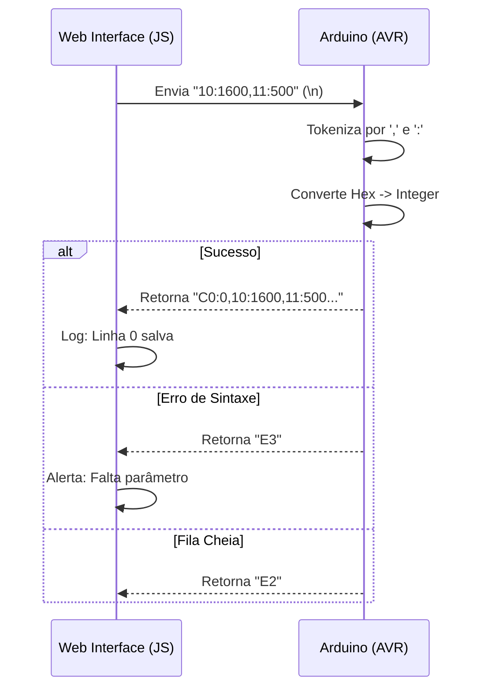

# Guia de Integração: Web Interface <> Firmware AVR

Este documento detalha o protocolo de comunicação e a arquitetura de integração entre a interface HTML5 (frontend) e o firmware ATmega328P (backend/hardware).

## 🏗️ Arquitetura de Comunicação

O projeto utiliza a **Web Serial API** para estabelecer um túnel de comunicação direta entre o navegador e o microcontrolador via USB.

- **Camada de Transporte**: Serial RS-232 (over USB).
- **Configuração**: 115200 bps, 8-N-1.
- **Protocolo**: Texto baseado em pares Chave:Valor em Hexadecimal, terminados por `\n`.

## 🤝 Handshake e Inicialização

Ao ser energizado ou resetado, o Arduino envia um sinal de prontidão:

1.  **Arduino -> Web**: Envia `A0` (Hex para 160).
2.  **Web -> Usuário**: A interface detecta o código e exibe "Sistema Inicializado com Sucesso".

## 📟 Protocolo Hexadecimal (H8P)

Para economizar SRAM (limitada a 2KB no ATmega328P), o sistema não processa strings como "move:1600". Ele utiliza chaves de 1 byte (representadas por 2 caracteres hexadecimais).

### 📤 Comandos de Fluxo (Web -> INO)

Estes comandos disparam ações imediatas no sistema de estados.

| Chave | Ação | Descrição |
| :--- | :--- | :--- |
| `01` | **RUN** | Inicia a execução sequencial da fila de comandos. |
| `02` | **STOP** | Interrompe o Timer1 via operação atômica (`cli`/`sei`), limpa a fila e desativa o motor. |
| `03` | **REPEAT ALL** | Define a flag `repetir_todas_linhas` como verdadeira. |
| `04:X` | **PAUSE GLOBAL** | Define um tempo de espera (ms) genérico para todas as transições de linha. |

### 🛰️ Telemetria Ativa (H8P V2 - Arduino -> Web)

Estes códigos são enviados passivamente pelo Arduino para atualizar a saúde e estado do sistema na interface.

| Chave | Nome | Descrição |
| :--- | :--- | :--- |
| `B3:X` | **Hardware Pause** | Reporta uma pausa em execução de X milissegundos. |
| `C1:X` | **Queue Size** | Reporta que a fila de comandos possui X slots preenchidos na SRAM. |
| `D0:X` | **Active Line** | Reporta que a linha de movimento ID X foi disparada via Timer1. |

### 📥 Parâmetros de Motor (Web -> INO)

Enviados como uma string única contendo múltiplos campos separados por vírgula.
Exemplo: `10:1600,11:500,12:1,13:2,14:100`

| Chave | Parâmetro | Unidade | Obrigatório |
| :--- | :--- | :--- | :--- |
| `10` | Steps | Quantidade | Sim |
| `11` | Intervalo | Microssegundos (µs) | Sim (Min: 50) |
| `12` | Direção | 0 ou 1 | Não (Default: 0) |
| `13` | Repeat | Quantidade (0 = inf) | Não (Default: 1) |
| `14` | Pause After | Milissegundos (ms) | Não (Default: 0) |

> [!CAUTION]
> **Segurança de Frequência (Clamp)**: O firmware impõe um limite mínimo de **50µs** para o intervalo (`11`). Valores menores que este são rejeitados para evitar o travamento (*starvation*) do microcontrolador por excesso de interrupções.

## 🔄 Fluxo de Dados (Comando de Fila)

## ⚡ Comandos Compostos (Macros da UI)

A interface Web implementa comportamentos complexos combinando os comandos atômicos do firmware:

### **Run One Step (Executar Passo Único)**
Para simular um movimento isolado sem poluir a fila permanente:
1.  **UI envia** `02`: Limpa qualquer resíduo na fila.
2.  **UI envia** `10:X,11:Y...`: Carrega o comando desejado.
3.  **UI envia** `01`: Dispara a execução imediatamente.

## 🛠️ Tratamento de Respostas

O JavaScript na interface (`index.html`) utiliza um `TextDecoderStream` para ler o buffer serial. Ele procura pelo caractere de quebra de linha `\n`, extrai o código hex e traduz para mensagens amigáveis ao usuário via objeto `hexResponses`.

---
*Para detalhes sobre a implementação do Timer, veja o arquivo [stepcontrol.ino](../stepcontrol/stepcontrol.ino).*
