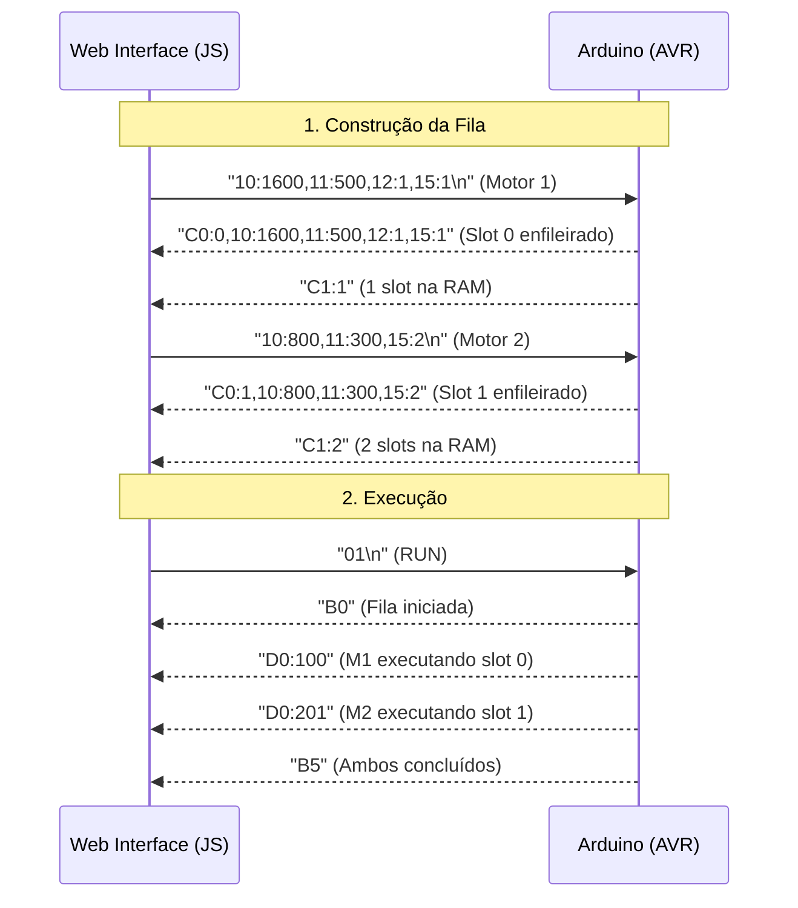
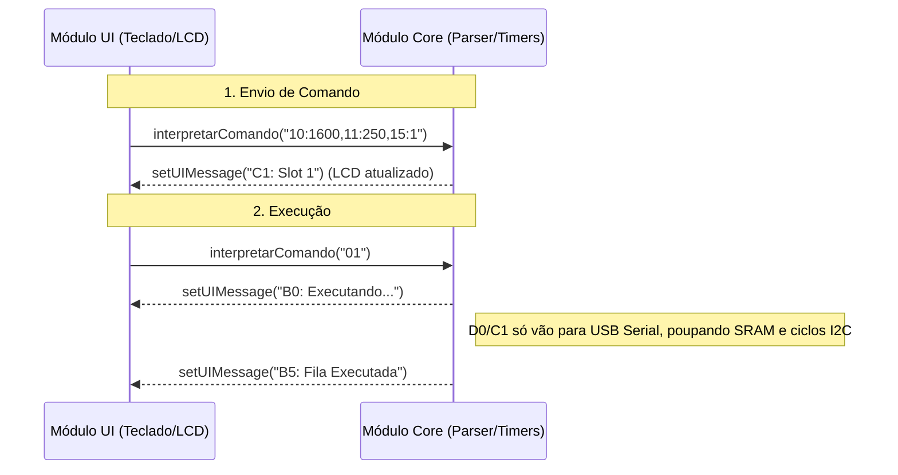

# Guia de Integração: Web Interface <> Firmware AVR

Este documento detalha o protocolo de comunicação e a arquitetura de integração entre a interface HTML5 (frontend), o firmware ATmega328P (backend/hardware) e o módulo periférico StepCommander.

---

## 🏗️ Arquitetura Monolítica (Integração)

O projeto evoluiu para uma **arquitetura monolítica** rodando centralizada em um **Arduino Mega 2560**. O firmware unifica o controle lógico (StepCommander) e o controle de potência (StepControl) em um único chip, eliminando a latência e a complexidade de comunicação entre duas placas físicas.

Existem duas formas principais de interagir com o "Core" do controlador (Módulo de Execução):

| Canal | Meio | Integração | Uso |
|:---|:---|:---|:---|
| **USB Serial** | Hardware Serial (UART) | Externa (Porta RX0/TX1) | Interface Web (Chrome/Edge via Web Serial API) |
| **Interface Local**| Teclado 4x4 / LCD I2C | Interna (Chamadas de API) | Painel físico operado pelo usuário (Ex-StepCommander) |

- **Protocolo Base**: Texto em pares `Chave:Valor` hexadecimais, separados por vírgula.

### Desacoplamento Lógico (Virtual Serial)

Mesmo rodando no mesmo chip, o código mantém um **desacoplamento estrito** entre o Módulo de Interface Local (Commander) e o Módulo de Execução (Motores):

1. **Módulo Commander (UI & Atalhos)**: Captura as teclas (`PCINT2`), gerencia o display I2C e resolve atalhos.
2. **Módulo StepControl (Execução)**: Gerencia os motores, a Fila (SRAM), os Timers e a EEPROM. 
3. **A Ponte (`interpretarComando`)**: Quando o Commander compila uma linha de comando, ele a repassa para a função `interpretarComando(char*)`, atuando como se fosse um cliente serial enviando texto pela porta. O fluxo de execução e validação é idêntico ao da USB Serial.

As respostas do núcleo são despachadas via função `setUIMessage()` (que atualiza o LCD localmente) e impressas na Serial (para a Interface Web). Telemetrias de alta frequência (`D0`, `C1`) são exclusivas da USB Serial para não travar o loop de interrupções atualizando o lento barramento I2C do LCD.

---

## 🤝 Handshake e Inicialização

Ao ser energizado ou resetado, o Arduino emite um sinal de prontidão via **broadcast** (ambas as portas):

1. **Arduino → Web + Commander**: Envia `A0`.
2. **Web**: Exibe "Sistema Inicializado. Timer1 Dual-Channel sincronizado."
3. **Commander**: LCD exibe "Sis Inicializado".

---

## 📟 Protocolo Hexadecimal (H8P)

Para economizar SRAM (2KB disponíveis no ATmega328P), o sistema não processa strings longas. Usa chaves de 1 byte (2 chars hexadecimais).

### 📤 Comandos de Controle (Enviados → Arduino)

#### `01` RUN
Inicia a execução simultânea das filas de motor.

**Parameters:**
| Name | Type | Required | Description |
|------|------|----------|-------------|
| - | - | - | Comando sem parâmetros adicionais |

**Response:**
- `B0`: Fila iniciada (Broadcast)
- `E0`: Operação rejeitada — motores em execução ativa
- `E1`: Fila vazia

**Example:**
Request: `01`
Response: `B0`

#### `02` STOP (Graceful Stop / Parada Suave)
Cancela repetições e esvazia a fila atual, mas permite que os passos do comando já em execução terminem naturalmente. Se não houver movimento em andamento, a parada é imediata.

**Parameters:**
| Name | Type | Required | Description |
|------|------|----------|-------------|
| - | - | - | Comando sem parâmetros adicionais |

**Response:**
- `B1`: Motor PARADO e Fila limpa (Broadcast)
- `C1:0`: Telemetria de fila vazia

**Example:**
Request: `02`
Response: `B1` + `C1:0`

#### `03` RepeatAll / Loop Mode
Define se a fila deve recomeçar do zero após atingir o final.

**Parameters:**
| Name | Type | Required | Description |
|------|------|----------|-------------|
| flag | integer | Yes | `1` ativa loop infinito, `0` desativa |

**Response:**
- `B4`: Modo repeatAll ATIVADO (Broadcast)
- `B6`: Modo repeatAll DESATIVADO (Broadcast)

**Example:**
Request: `03:1`
Response: `B4`

#### `04` Global Pause
Define um atraso em milissegundos injetado entre comandos da fila.

**Parameters:**
| Name | Type | Required | Description |
|------|------|----------|-------------|
| ms | integer | Yes | Tempo em milissegundos |

**Response:**
- `B2:X`: Pausa global definida (Broadcast)

**Example:**
Request: `04:1000`
Response: `B2:1000`

#### `16` Enable Motor
Habilita fisicamente o estágio de potência do driver (EN Pin → LOW).

**Parameters:**
| Name | Type | Required | Description |
|------|------|----------|-------------|
| motor | integer | Yes | `1` para Motor 1, `2` para Motor 2 |

**Response:**
- `B7:X`: Motor habilitado (Broadcast)

**Example:**
Request: `16:1`
Response: `B7:1`

#### `17` Disable Motor
Desabilita fisicamente o estágio de potência do driver (EN Pin → HIGH).

**Parameters:**
| Name | Type | Required | Description |
|------|------|----------|-------------|
| motor | integer | Yes | `1` para Motor 1, `2` para Motor 2 |

**Response:**
- `B8:X`: Motor desabilitado (Broadcast)

**Example:**
Request: `17:1`
Response: `B8:1`

#### `18` Fast Action (EEPROM)
Executa o preset armazenado em um slot da EEPROM.

**Parameters:**
| Name | Type | Required | Description |
|------|------|----------|-------------|
| slot | integer | Yes | Slot da EEPROM (0 a 9) |

**Response:**
- `BB:X,10:step,...`: Preset executado (Completo via USB, apenas `BB:X` via Commander)
- `E4`: Slot Inválido
- `E0`: Motor em execução

**Example:**
Request: `18:2`
Response: `BB:2,10:1600,11:500,12:1,13:1,14:0,15:1`

#### `19` Write Preset
Grava uma linha completa de comando na EEPROM.

**Parameters:**
| Name | Type | Required | Description |
|------|------|----------|-------------|
| slot | integer | Yes | Slot da EEPROM (0 a 9) |
| 10 | integer | Yes | Quantidade de passos |
| 11 | integer | Yes | Intervalo (µs) |
| 12 | integer | No | Direção (`0` ou `1`) |
| 13 | integer | No | Repetições |
| 14 | integer | No | Pausa (ms) |
| 15 | integer | No | Motor (`1` ou `2`) |

**Response:**
- `B9:X,10:step,...`: Preset gravado com sucesso
- `E3`: Erro de sintaxe
- `E4`: Slot Inválido

**Example:**
Request: `19:2,10:800,11:300,12:0`
Response: `B9:2,10:800,11:300,12:0,13:1,14:0,15:1`

#### `1A` Read Preset
Solicita o dump de dados de um slot da EEPROM.

**Parameters:**
| Name | Type | Required | Description |
|------|------|----------|-------------|
| slot | integer | Yes | Slot da EEPROM (0 a 9) |

**Response:**
- `BA:X,10:step,...`: Dump do preset

**Example:**
Request: `1A:2`
Response: `BA:2,10:800,11:300,12:0,13:1,14:0,15:1`

#### `1B` Scrubber / Jog (Fast Action Repeat)
Executa preset com repetições forçadas. Direção é invertida se repetições forem negativas.

**Parameters:**
| Name | Type | Required | Description |
|------|------|----------|-------------|
| slot | integer | Yes | Slot da EEPROM (0 a 9) |
| rep | integer | Yes | Repetições (se <0 inverte direção original) |

**Response:**
- `BC:X,10:step,...`: Preset executado com override
- `E4`: Slot Inválido

**Example:**
Request: `1B:0:-4`
Response: `BC:0,10:1600,11:400,12:0,13:4,14:0,15:1`

#### `1C` Save SRAM to EEPROM
Salva a linha de comando do slot SRAM no slot EEPROM.

**Parameters:**
| Name | Type | Required | Description |
|------|------|----------|-------------|
| e_slot| integer | Yes | Slot EEPROM destino (0 a 9) |
| s_slot| integer | Yes | Slot SRAM origem (0 a 19) |

**Response:**
- `B9:X,10:step,...`: Preset salvo e confirmado
- `E1`: SRAM vazia/inválida
- `E4`: Slot EEPROM inválido

**Example:**
Request: `1C:3:2`
Response: `B9:3,10:1600,11:500,12:1,13:1,14:0,15:1`

### 📥 Parâmetros de Motor (Data Injection)

Enviados como string de campos hexadecimais separados por vírgula. Comandos `10` a `15` montam uma instrução na fila SRAM.

**Parameters:**
| Chave | Parâmetro | Unidade | Obrigatório | Descrição |
|:---|:---|:---|:---|:---|
| `10` | **Steps** | Qtd Passos | ✅ Sim | Quantidade de passos a executar |
| `11` | **Interval**| Microssegundos (µs)| ✅ Sim (Min: 50) | Intervalo entre pulsos |
| `12` | **Direction**| `0` (REV) / `1` (FWD) | ❌ Não | Sentido de rotação |
| `13` | **Repeat** | Ciclos (`0` = ∞) | ❌ Não | Repetições da instrução |
| `14` | **Pause** | Millissegundos (ms) | ❌ Não | Pausa pós-instrução |
| `15` | **Target** | `1` (M1) / `2` (M2) | ❌ Não | Motor Alvo |

**Response:**
- `C0:X,10:step,...`: Comando enfileirado com sucesso no slot SRAM X.
- `C1:X`: Quantidade atual de slots ocupados na fila SRAM.
- `E2`: Fila SRAM cheia (máx 20).
- `E3`: Parâmetros obrigatórios ausentes.

**Example:**
Request: `10:1600,11:400,12:0,13:5,15:2`
Response: `C0:0,10:1600,11:400,12:0,13:5,14:0,15:2`

> [!CAUTION]
> **Safety Clamp de Frequência**: O firmware rejeita intervalos (`11`) menores que **50µs**. Valores abaixo disso causariam *starvation* de interrupções e travamento do MCU. A resposta de rejeição é `E3`.

> [!IMPORTANT]
> **Campos obrigatórios**: `10` e `11` são **sempre obrigatórios**. Se ausentes, o firmware retorna `E3` e descarta o pacote inteiro sem gravar na fila.

---

## 📡 Respostas do Arduino (Arduino → Interfaces)

### Respostas de Status

| Código | Nome | Roteamento | Descrição |
|:---|:---|:---|:---|
| `A0` | **Init OK** | Broadcast | Sistema inicializado. Timer1 Dual-Channel pronto. |
| `B0` | **Run Started** | Broadcast | Fila iniciada. Pulsos sendo despachados para M1 e/ou M2. |
| `B1` | **Emergency Stop** | Broadcast | Ambos os motores parados. Fila e RAM limpas. |
| `B2:X` | **Global Pause Set** | Broadcast | Pausa global definida para X ms. |
| `B4` | **Repeat ON** | Broadcast | Loop infinito ativado (`03:1` recebido). |
| `B5` | **Queue Done** | Broadcast | Todos os motores concluíram a fila. Standby. |
| `B6` | **Repeat OFF** | Broadcast | Loop infinito desativado (`03:0` recebido). |
| `B7:X` | **Motor Enabled** | Broadcast | Driver do Motor X habilitado (EN → LOW). |
| `B8:X` | **Motor Disabled** | Broadcast | Driver do Motor X desabilitado (EN → HIGH). |
| `E0` | **Already Running** | Somente Origem | Operação rejeitada — motores em execução ativa. |
| `E1` | **Queue Empty** | Somente Origem | Fila vazia ou slot SRAM inválido. |
| `E2` | **Queue Overflow** | Somente Origem | Limite de 20 slots atingido na SRAM. |
| `E3` | **Syntax Error** | Somente Origem | Parâmetros obrigatórios ausentes no pacote. |
| `E4` | **Invalid Slot** | Somente Origem | Slot EEPROM fora do intervalo (0-9). |

### Respostas de Dados (Formato varia por interface)

| Código | Nome | USB Serial | Commander |
|:---|:---|:---|:---|
| `B9:X` | **Preset Saved** | `B9:X,10:step,...` (completo) | `B9:X` (otimizado) |
| `BA:X` | **Preset Data** | `BA:X,10:step,...` (completo) | `BA:X` (otimizado) |
| `BB:X` | **Preset Executed** | `BB:X,10:step,...` (completo) | `BB:X` (otimizado) |
| `BC:X` | **Rep Override** | `BC:X,10:step,...` (completo) | `BC:X` (otimizado) |
| `C0:X` | **Slot Enqueued** | `C0:X,10:step,...` (completo) | `C0:X` (otimizado) |

### 🛰️ Telemetria de Alta Frequência (USB Serial Only)

Emitidos continuamente pelo Arduino para atualizar o painel "Live Telemetry". **Não são enviados ao Commander** para evitar bloqueio de interrupts.

| Código | Nome | Formato | Descrição |
|:---|:---|:---|:---|
| `C1:X` | **Queue Size** | `C1:N` | Quantidade atual de slots ocupados na SRAM (0–20). |
| `D0:X` | **Active Line** | `D0:MNN` | Linha NN do Motor M foi disparada. Ex: `D0:101` = Motor 1, slot 1. |

> [!NOTE]
> **Formato de `D0`**: O valor codifica motor e slot em um único inteiro. `floor(X / 100)` extrai o motor; `X % 100` extrai o índice do slot.

---

## 🔄 Fluxo de Dados — Ciclo Completo

### Via Web Interface (USB Serial)



### Via Interface Local (Painel Embutido)



---

## ⚡ Macros da Interface Web

A interface combina comandos atômicos para implementar comportamentos compostos.

### Run One Step (Movimento Isolado)

Para testar um movimento sem contaminar a fila persistente:

1. UI envia `02` — limpa qualquer resíduo na fila.
2. UI envia `10:X,11:Y,15:Z` — carrega o comando desejado.
3. UI envia `01` — dispara execução imediatamente.

### Execute All (RUN com controle de Loop)

Quando o usuário clica em **EXECUTE ALL**, a interface injeta o estado atual do botão Mestre de Loop antes do `01`:

1. UI envia `03:1` (se toggle ON) ou `03:0` (se toggle OFF).
2. UI envia `01` — inicia a execução com o modo de loop já definido no MCU.

### Carregar Sequência da Biblioteca

Ao carregar uma sequência salva do `localStorage`, a interface executa limpeza automática antes de injetar:

1. UI envia `02` — limpa SRAM do MCU (STOP atômico).
2. `currentQueue = []` — reseta a fila local JS.
3. UI envia cada comando da sequência com delay de 150ms entre eles.

### Enable/Disable Motor (Controle do Driver)

Os toggle switches integrados ao seletor de motor disparam comandos de controle do driver:

- **Checkbox marcado** → UI envia `16:X` (Enable Motor X: EN → LOW).
- **Checkbox desmarcado** → UI envia `17:X` (Disable Motor X: EN → HIGH).

O firmware confirma com `B7:X` ou `B8:X`, e a telemetria atualiza o estado para "Driver ON" ou "Driver OFF".

> [!NOTE]
> O TB6600 usa lógica de **enable ativo-baixo**: `LOW` habilita o driver (torque de retenção ativo), `HIGH` desabilita (eixo livre).

---

## 🛠️ Detalhes Internos do Firmware

### Máquina de Estados (`maquinaDeEstadosMotor`)

Dois pipelines paralelos e independentes, executados a cada iteração do `loop()`:

```
Pipeline M1:
  m1_executando && !m1_em_movimento
    → em pausa? → aguardar millis()
    → senão?    → avancarFilaM1()

Pipeline M2:
  m2_executando && !m2_em_movimento
    → em pausa? → aguardar millis()
    → senão?    → avancarFilaM2()

Cleanup Global (portão fila_iniciada):
  fila_iniciada && !m1_executando && !m2_executando && qtd > 0
    → qtd = 0, fila_iniciada = false → emite B5 (Broadcast)
```

### Flag `fila_iniciada`

Gate crítico que impede a limpeza prematura da fila. O bug era: a condição de cleanup global (`!m1_executando && !m2_executando && qtd > 0`) era verdadeira a cada `loop()` após salvar um comando — antes do RUN ser enviado — destruindo a fila silenciosamente. A flag garante que a limpeza só ocorra após o motor ter realmente iniciado execução.

### ISRs dos Canais

```cpp
ISR(TIMER1_COMPA_vect) { /* Pulsa M1_PUL_PIN, recalcula OCR1A */ }
ISR(TIMER1_COMPB_vect) { /* Pulsa M2_PUL_PIN, recalcula OCR1B */ }
```

Cada ISR recalcula seu próprio `next_compare = TCNT1 + ticks_necessarios`, garantindo independência total de timing entre os dois canais.

---

*Para o esquema de ligação de hardware completo, veja [README.md](../README.md).*
